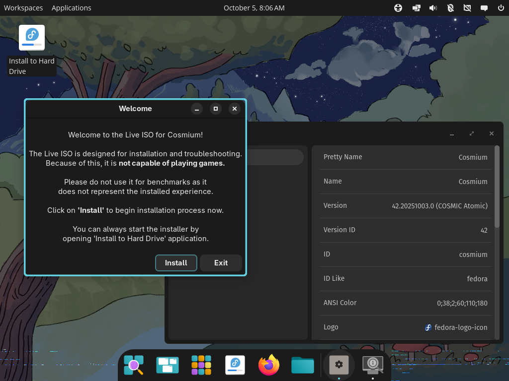

# Cosmium [WIP]

Note: to test it out on QEMU/Virt-manager, switch display input from Virtio to QXL. (not exclusive to Cosmium btw)

Latest Live ISO builds (you have to be logged in to GitHub):
- **Stable**: https://github.com/Cosmium-OS/Cosmium/actions/workflows/build-iso-live.yml?query=is%3Asuccess
- **Testing (even more updates than stable)**: https://github.com/Cosmium-OS/Cosmium/actions/workflows/build-iso-live-testing.yml?query=is%3Asuccess

Grab the latest successful artifact for either Desktop or Gaming Handheld Edition (`cosmium` or `cosmium-deck`). No matter for how long those ISOs wasn't updated, you can still perform an update by running `sudo bootc update` no matter what. New builds would be triggered when it is appropriate to do so (like changing branding, new flatpak apps, fixes to Live ISO environment, etc). We're using Universal Blue's [titanoboa](https://github.com/ublue-os/titanoboa) to make this happen :).

TODO: 
- [ ] (Re-)rewrite this file
- [ ] Fix timezone weirdness on Live ISO environment (look up on screenshot)
- [ ] Change favorite apps on dock for Live ISO environment
- [ ] COSMIC focuses on Steam Keyboard, making it impossible to type from Steam Deck (presense on Gaming Handheld Edition)
- [ ] ... because of that maybe enable on-screen keyboard that is compatible with COSMIC?
- [ ] Remove COSMIC Store and replace it with configured Bazaar (we already have both installed, Bazaar isn't configured)
- [ ] Fix switching to desktop mode on Gaming Handheld Edition
- [ ] Enable auto-login to Steam Gaming Mode on Gaming Handheld Edition
- [ ] Switch to Anaconda WebUI when it is stable enough
- [ ] Add more third-party themes to the system and maybe even widgets
- [ ] Switch to own underlying image of Fedora COSMIC Atomic when Universal Blue will [deprecated it](https://github.com/ublue-os/main/issues/927) ([`cosmic-atomic-custom`](https://github.com/Cosmium-OS/cosmic-atomic-custom), do it like Winblues does)
- [ ] Add Nvidia-open variants
- [ ] Do a proper branding
- [ ] Figure out secure boot and kernel signing

Thanks to https://github.com/askpng/solarpowered for providing some hack for installing Bazzite kernel!
